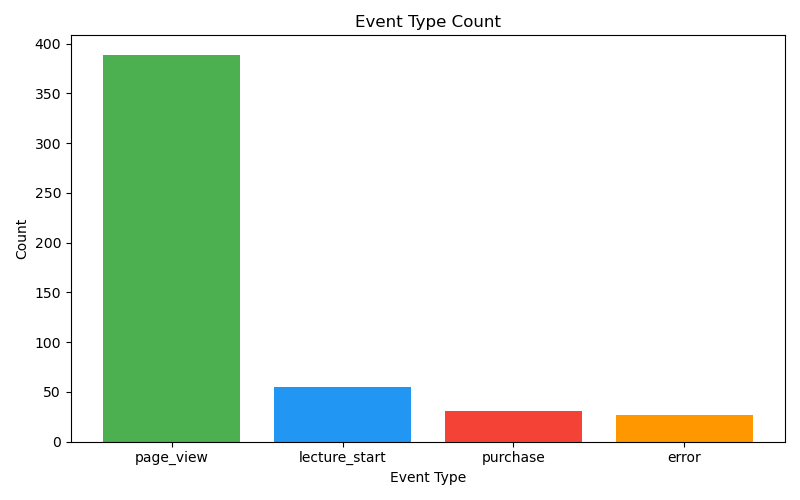
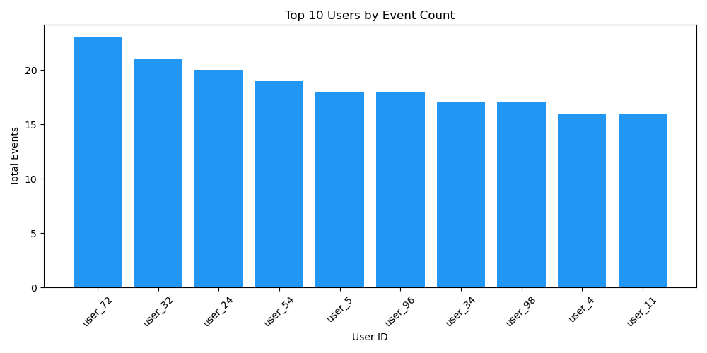
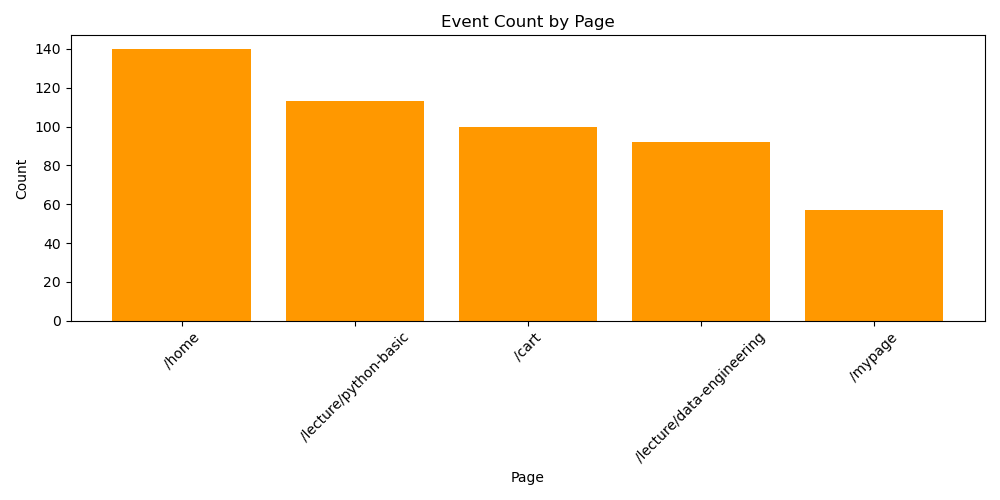
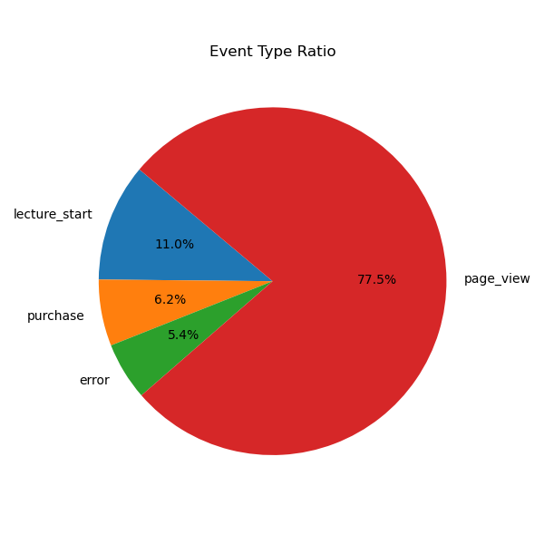
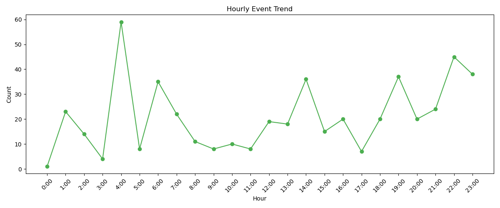
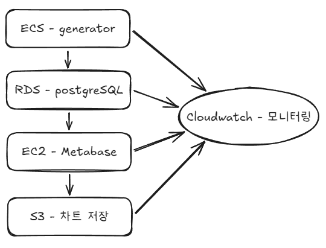

# 이벤트 로그 파이프라인

## 📌 프로젝트 개요

온라인 강의 플랫폼에서 발생하는 유저 행동 이벤트를 생성하고, 저장하고, 분석하고, 시각화하는 파이프라인입니다.

**파이프라인 흐름**
```
이벤트 생성 (Python) → 저장 (PostgreSQL) → 분석 (SQL) → 시각화 (matplotlib)
```

## 🚀 실행 방법

### 필요한 도구
- Docker
- Docker Compose
- Python 3.11 이상

### 실행 방법

1. 레포지토리 클론
```bash
git clone https://github.com/Songhyun98/liveclass-data-pipeline.git
cd liveclass-data-pipeline
```

2. 이벤트 생성 및 DB 저장 (Docker)
```bash
docker compose up --build
```

3. 시각화 실행 (로컬)
```bash
pip install matplotlib psycopg2-binary
python visualize/visualize.py
```

4. 결과 확인
- `charts/event_type_count.png` - 이벤트 타입별 발생 횟수
- `charts/event_type_ratio.png` - 이벤트 타입 비율
- `charts/top_users.png` - 유저별 총 이벤트 수 상위 10명
- `charts/page_count.png` - 페이지별 이벤트 발생 횟수
- `charts/hourly_trend.png` - 시간대별 이벤트 추이

## 🎯 이벤트 설계

라이브클래스와 같은 온라인 강의 플랫폼에서 실제로 발생할 수 있는 유저 행동을 기반으로 이벤트를 설계했습니다.

| 이벤트 타입 | 발생 페이지 | 설명 |
|------------|------------|------|
| `page_view` | `/home`, `/lecture/*`, `/cart`, `/mypage` | 페이지 조회 |
| `lecture_start` | `/lecture/*` | 강의 수강 시작 (강의 페이지 방문 후에만 발생) |
| `purchase` | `/cart` | 강의 구매 (/cart 방문 후에만 발생) |
| `error` | 모든 페이지 | 어느 단계에서든 발생 가능, 발생 시 세션 종료 |

State Machine 방식으로 유저 행동 흐름을 설계했습니다. 각 페이지에서 다음 페이지로 이동할 확률을 정의해 모든 페이지 간 이동이 가능하면서도 현실적인 흐름이 나오도록 했습니다. `lecture_start`는 강의 페이지에서만, `purchase`는 `/cart`에서만 발생하도록 제한했습니다.

## 🗄️ 스키마 설명

```sql
CREATE TABLE events (
    id          SERIAL PRIMARY KEY,
    event_type  VARCHAR(50) NOT NULL,
    user_id     INTEGER NOT NULL,
    session_id  VARCHAR(50) NOT NULL,
    page        VARCHAR(100),
    created_at  TIMESTAMP NOT NULL DEFAULT NOW()
)
```

### 이렇게 설계한 이유

단순히 JSON을 통째로 저장하지 않고 필드를 컬럼으로 분리했습니다. 이렇게 하면 `event_type`별로 필터링하거나 `user_id`별로 집계하는 등 SQL로 다양한 분석이 가능합니다. `created_at`을 별도 컬럼으로 관리해 시간대별 이벤트 추이 분석도 할 수 있습니다.

## 📊 분석 쿼리

### 1. 이벤트 타입별 발생 횟수
```sql
SELECT event_type, COUNT(*) AS count
FROM events
GROUP BY event_type
ORDER BY count DESC;
```

### 2. 유저별 총 이벤트 수 (상위 10명)
```sql
SELECT user_id, COUNT(*) AS total_events
FROM events
GROUP BY user_id
ORDER BY total_events DESC
LIMIT 10;
```

### 3. 페이지별 이벤트 발생 횟수
```sql
SELECT page, COUNT(*) AS count
FROM events
GROUP BY page
ORDER BY count DESC;
```

### 4. 에러 이벤트 비율
```sql
SELECT 
    ROUND(COUNT(*) FILTER (WHERE event_type = 'error') * 100.0 / COUNT(*), 2) AS error_rate
FROM events;
```

### 5. 시간대별 이벤트 추이
```sql
SELECT EXTRACT(HOUR FROM created_at) AS hour, COUNT(*) AS count
FROM events
GROUP BY hour
ORDER BY hour;
```

## 📈 시각화 결과

### 이벤트 타입별 발생 횟수


### 유저별 총 이벤트 수 (상위 10명)


### 페이지별 이벤트 발생 횟수


### 에러 이벤트 비율(이벤트 타입 비율)


### 시간대별 이벤트 추이


## ☸️ Kubernetes (선택 A)

### 작성한 manifest 파일

**configmap.yaml**
DB 접속 정보를 코드에 직접 하드코딩하지 않고 ConfigMap으로 분리했습니다. DB 주소가 바뀌어도 코드 수정 없이 ConfigMap만 수정하면 됩니다.

**deployment.yaml**
이벤트 생성기 앱을 Kubernetes에 배포하기 위한 Deployment입니다. `replicas: 2`로 설정해 컨테이너를 2개 띄워 안정성을 높였습니다.

### 리소스를 선택한 이유

| 리소스 | 역할 | 선택 이유 |
|--------|------|----------|
| `ConfigMap` | 환경변수 관리 | DB 접속 정보를 코드와 분리해 유지보수 용이 |
| `Deployment` | 컨테이너 배포 및 관리 | 자동 복구, 스케일링 등 운영 편의성 제공 |

## ☁️ AWS 아키텍처 (선택 B)

### 아키텍처 구성도


### 사용한 AWS 서비스와 선택 이유

| 서비스 | 역할 | 선택 이유 |
|--------|------|----------|
| `ECS` | 이벤트 생성기 컨테이너 실행 | Docker 컨테이너를 AWS에서 그대로 실행 가능 |
| `RDS` | PostgreSQL DB 운영 | 백업, 복구, 보안을 AWS가 자동으로 관리 |
| `EC2` | Metabase 시각화 도구 실행 | 직접 설치형 BI 도구 운영에 적합 |
| `S3` | 차트 이미지 저장 | 저렴하고 무제한 파일 저장 가능 |
| `CloudWatch` | 전체 서비스 모니터링 | 각 서비스 로그와 메트릭을 한곳에서 관리 |

### AWS 서비스 역할 차이

**ECS vs EC2**
ECS는 Docker 컨테이너를 자동으로 관리해주는 서비스고, EC2는 그냥 서버입니다. ECS가 EC2 위에서 동작하는 구조입니다. generator는 ECS로 컨테이너 형태로 실행하고, Metabase는 EC2에 직접 설치하는 방식을 선택했습니다. Metabase도 컨테이너로 실행할 수 있지만, 이 경우 EC2에 직접 설치하는 방식이 설정이 간단하고 소규모 서비스에 적합하다고 판단했습니다.

**RDS vs S3**
RDS는 PostgreSQL 같은 DB를 관리해주는 서비스고, S3는 파일 저장소입니다. 이벤트 데이터는 SQL로 바로 분석해야 해서 RDS에 저장했고, 차트 이미지처럼 파일 형태의 데이터는 S3에 저장했습니다.

**CloudWatch**
ECS, RDS, EC2 등 모든 서비스의 로그와 메트릭을 한곳에서 모니터링할 수 있는 서비스입니다. 각 서비스가 정상 동작하는지 확인하고 이상이 생기면 알람을 보내줍니다.

### 설계하면서 가장 고민한 부분

시각화 도구를 어디에 배치할지 고민했습니다. Metabase를 EC2에 직접 설치하는 방식과 AWS QuickSight를 사용하는 방식 중 EC2를 선택했습니다. QuickSight는 관리가 편하지만 비용이 발생하고, Metabase는 오픈소스라 무료로 사용할 수 있기 때문입니다.

또한 이벤트 데이터를 S3가 아닌 RDS에 저장한 이유는 SQL로 바로 분석하기 위해서입니다. S3는 파일 저장소라 SQL을 바로 실행할 수 없지만 RDS는 바로 쿼리가 가능합니다. 실제 대규모 서비스라면 S3에 원본 데이터를 백업하고 RDS는 분석용으로 함께 운영하는 방식을 선택했을 것입니다.

## 💭 구현하면서 고민한 점

### 이벤트 설계
처음에는 이벤트 타입과 페이지를 각각 랜덤으로 생성했는데, `purchase`가 `/home`에서 발생하는 등 현실과 맞지 않는 조합이 나왔습니다. 이를 해결하기 위해 State Machine 방식을 도입해 각 페이지에서 다음 상태로 이동할 확률을 정의했습니다. `lecture_start`는 강의 페이지에서만, `purchase`는 `/cart`에서만 발생하도록 제한했습니다.

### 세션 내 이벤트 흐름
같은 세션 내에서 이벤트 순서가 현실적이지 않은 문제가 있었습니다. 예를 들어 `/cart` 방문 없이 `purchase`가 발생하거나, 강의 페이지 방문 없이 `lecture_start`가 발생하는 경우였습니다. State Machine으로 각 이벤트가 올바른 페이지에서만 발생하도록 수정했고, 에러 발생 시 세션이 즉시 종료되도록 했습니다.

### 타임스탬프 설계
초기에는 이벤트가 거의 동시에 생성되어 시간대별 분석이 의미없었습니다. 세션 시작 시각을 최근 7일 내 랜덤으로 설정하고, 같은 세션 내 이벤트는 10~300초 간격으로 순차적으로 발생하도록 수정해 시간대별 분석이 가능하도록 했습니다.

### Docker 환경에서의 DB 연결
Docker Compose로 띄울 때 DB 컨테이너가 준비되기 전에 generator가 먼저 실행되는 문제가 있었습니다. 이를 해결하기 위해 DB 연결 실패 시 3초 대기 후 최대 10번 재시도하는 로직을 추가했습니다.

### 포트 충돌
로컬에 PostgreSQL이 설치되어 있어 Docker DB와 포트가 충돌하는 문제가 있었습니다. Docker DB 포트를 `5434`로 변경해 해결했습니다.
